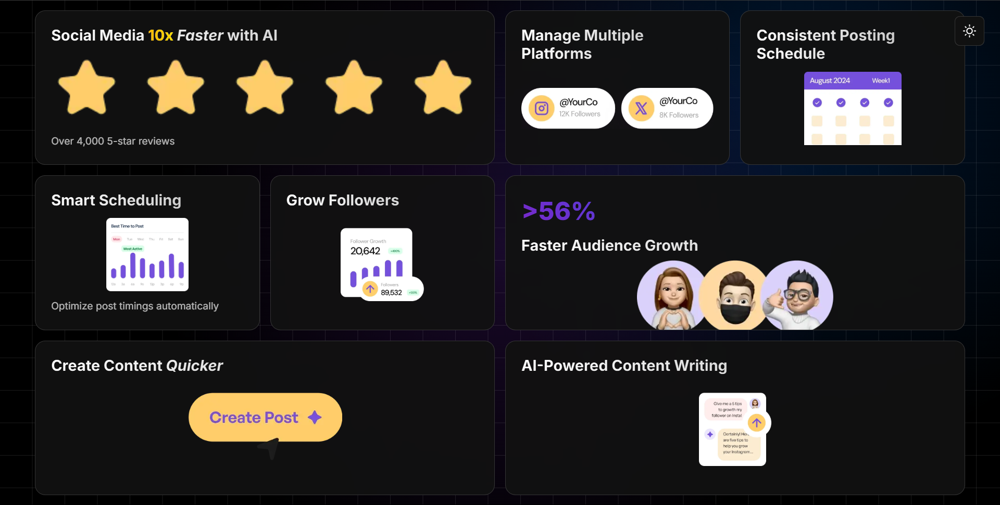
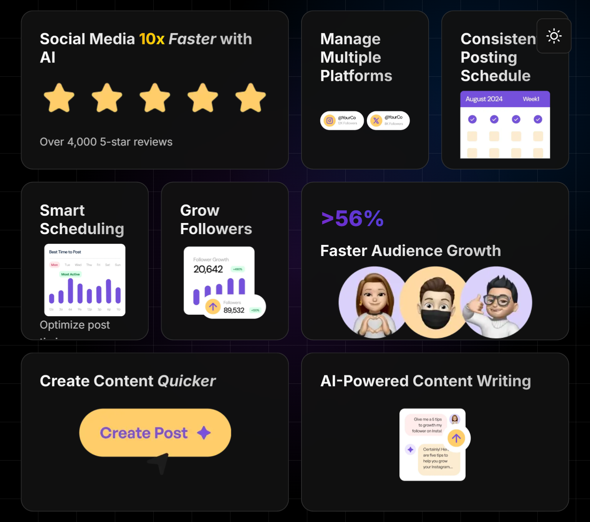

# Modern Bento Grid 🎨

<div align="center">


A modern, responsive Bento Grid layout inspired by Vercel's design aesthetic, featuring smooth animations, dynamic content blocks, and a beautiful dark/light mode implementation.

[Features](#-features) • [Tech Stack](#-tech-stack) • [Design Elements](#-design-elements) • [Installation](#-installation) • [Contributing](#-contributing) • [Screenshots](#-screenshots) • [Live](#-live) • [Author](#-author)

</div>

## ✨ Features

- 🎨 **Modern Bento Grid Layout** - Aesthetic and functional content organization
- 📱 **Fully Responsive** - Seamless experience across all device sizes
- ✨ **Smooth Animations** - Subtle hover effects and transitions
- 🎯 **Optimized Performance** - Fast loading and smooth interactions
- 🖼️ **Visual Hierarchy** - Clear content organization and emphasis
- 🌟 **Advanced CSS Effects** - Gradient overlays and backdrop filters

## 🛠 Tech Stack

### Core Technologies
- **HTML5** - Semantic markup structure
- **CSS3** - Advanced styling and animations
- **Inter Font** - Modern typography

### CSS Features
- Custom Properties (CSS Variables)
- CSS Grid
- Flexbox
- Backdrop Filter
- CSS Gradients
- Media Queries
- Clamp() for Responsive Typography

## 🎨 Design Elements

1. **Grid System**
   - Responsive 12-column grid
   - Dynamic area sizing
   - Adaptive spacing

2. **Visual Effects**
   - Background grid pattern
   - Gradient overlays
   - Hover animations
   - Border highlights

3. **Typography**
   - Inter font family
   - Responsive sizing
   - Gradient text effects
   - Multiple text styles

## 🚀 Installation

1. **Clone the repository**
   ```bash
   git clone https://github.com/yourusername/bento-grid.git
   cd bento-grid
   ```

2. **Open the project**
   ```bash
   # If you have VS Code and Live Server installed
   code .
   # Then use Live Server to run the project
   ```

3. **Alternative setup**
   ```bash
   # Using Python's built-in server
   python -m http.server 8000
   # Or using PHP's built-in server
   php -S localhost:8000
   ```

The website will be available at `http://localhost:8000` (or your specified port).

## 🎯 Customization

1. **Colors**
   ```css
   :root {
     --accent-purple: #your-color;
     --accent-blue: #your-color;
     --accent-cyan: #your-color;
   }
   ```

2. **Grid Layout**
   ```css
   .grid-container {
     grid-template-columns: repeat(your-columns, 1fr);
     grid-template-rows: repeat(your-rows, 1fr);
   }
   ```

3. **Animations**
   ```css
   .grid {
     transition: all var(--transition-timing);
   }
   ```

## 🤝 Contributing

We welcome contributions! Here's how you can help:

1. **Fork the repository**
2. **Create a feature branch:**

   ```bash
   git checkout -b feature/amazing-feature
   ```
3. **Commit your changes:**

   ```bash
   git commit -m 'Add amazing feature'
   ```
4. **Push to the branch:**

   ```bash
   git push origin feature/amazing-feature
   ```
5. **Open a Pull Request**

## 📸 Screenshots

<div align="center">

### Bento Grid Interface


### Tablet Bento Grid Interface


### Mobile Bento Grid Interface


</div>

## 🌍 Live

<div align="center">

[](https://your-demo-url.vercel.app/)

</div>

## 👤 Author

### Ashwin S Nambiar
- Portfolio: [ashwin-s-nambiar.is-a.dev](https://ashwin-s-nambiar.is-a.dev/)
- GitHub: [@Ashwin-S-Nambiar](https://github.com/Ashwin-S-Nambiar)

---

<div align="center">
Made with ❤️ by Ashwin S Nambiar
</div>